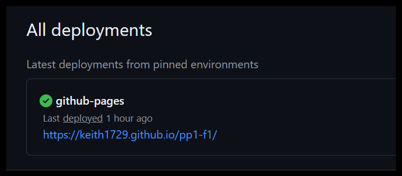

# Formula1 

  

This website was made to offer the user an insight into the world of Formula 1. It is informative and educational and portrays the sport with images of three of the top teams Red Bull, Ferrari and Mercedes.

## Table of contents:

<ol>
    <li>UX</li>
    <li>Features</li>
    <li>Technologies Used</li>
    <li>Testing</li>
    <li>Deployment</li>
    <li>Credits</li>
<ol>

----

## 1. UX
### Goals

The target audience for my Formula 1 website are:
- People who are interested in Formula 1
- People that wish to gain a brief understanding of Formula 1 technology
- People that want to see photography of the sport
- People that wish to learn more through a newsletter

User goals are:
- To learn more about the sport Formula 1
- To view a gallery of photographs showing the sport
- To sign up for a newsletter about the sport
- Gain social media links to follow the sport

The website will achieve this by:
- Giving a brief explanation of the technology of Formula 1 cars
- Offer a gallery of exciting photographs of the sport
- Offer a newsletter that a user can subscribe to
- Give a selection of different social media links that the user can follow

### Visual Design

### Wireframes

Balsamiq was leveraged to create a minimalistic but effective layout for each page of the website.

- Home 

  

- Gallery

  

- Fan Zone

  

### Fonts

  

- The font used for all the headings is "Open Sans". This was chosen for its clean lines and upright shape. It is a sans serif font and it delivers clear readable text on all devices.

- The font used for all the paragraph text is "Roboto". This was used for its geometric shape and clear legibility for comfortable reading on all devices.

### Icons

  

- All icons used in this website are taken from the Fontawesome icon library.
- The icons are utilised in the footer on all pages of the website.

### Colors

  

  

  

- The main theme for this website was a Formula 1 flagship Ferrari red color theme.
- This red coloring was maintained throughout the website for a consistent experience for the user.
- The primary color dark red (#8b0000) gives a "very good" contrast rating with the text color whitesmoke (#f5f5f5) and this is given a surrounding base with the accent color jet (#2a2a2a).
- These colors were assessed using the "Coolors" tool for contrast and suitability.

### Images

  

  

  

  

- This website uses energetic imagery to convey the sports action.
- It displays full-size quality images for exhibition purposes.
- In the gallery page the images are displayed in one or three columns, this depends on screen width and ensures ease of viewing for the user.

### Styling

- The styling for this website was centered around a red colored theme that links to the color of Ferrari who is the longest serving team on the F1 grid.

## 2. Features

### Page Elements

- All pages

  

  

The header with the navbar and footer with social media links exist on all pages. The navbar has a minimalistic style and its position is fixed to ensure the user can easily navigate the website from any location. The social media links in the footer provide the user with other ways of following the sport.

- Home page

  

The home page immediately produces an eye catching image of a Ferrari Formula 1 car, this is to draw in the attention of the user. The continuation of the deep red coloring with the contrast of the white headings and text hopefully entices the user to keep reading. The text is descriptive and informational, targeting the technology in Formula 1 cars.

- Gallery page

  

The gallery page presents striking images of three of the top teams in Formula 1, which give the user a good feel for the sport. On mobile devices the gallery shows one column of photos for comfortable viewing for the user, but for laptop screen sizes and larger the gallery transitions into three columns of photographs for better viewing for the user.

- Fan Zone page

  

The fan zone page offers the user a free newsletter to subscribe to if they wish to stay up to date on the news with their favourite team in Formula 1. This is offered in the form layout which is overlaid onto an image of an older Ferrari Formula 1 car.

## 3. Technologies Used

- HTML 

HyperText Markup Language, is the standard markup language used for creating web pages. It defines the content and structure of web content by using predefined tags and attributes. These elements instruct web browsers on how to display page content, including headings, lists, images, and links. HTML is human-readable and serves as the foundation for building web pages.

- CSS

Cascading Style Sheets is a language designed to simplify the process of making web pages presentable. It allows you to apply styles to HTML documents, describing how a webpage should look by prescribing colors, fonts, spacing, and positioning. CSS is independent of HTML and can be used with any XML-based markup language. In essence, it’s the magic that transforms plain HTML content into visually appealing and well-organized web pages!

## 4. Testing

### Validation

- HTML has been validated by W3C Markup Validation Service

  

- CSS has been validated by W3C CSS Validation Service

  

### General Testing

- All external links open in a new tab
- Internal navbar links open properly 
- Form was tested and works properly
- All features were tested on live website

### Bug Fixing

- The websites url was checked by W3C Link Checker and recommended two links were checked manually, these were checked on the live site and worked correctly.

  

## 5. Deployment

- The website was deployed on github-pages

  

## 6. Credits

- All images were taken from the Pexels free library
- All text was generated with Chat gpt4
